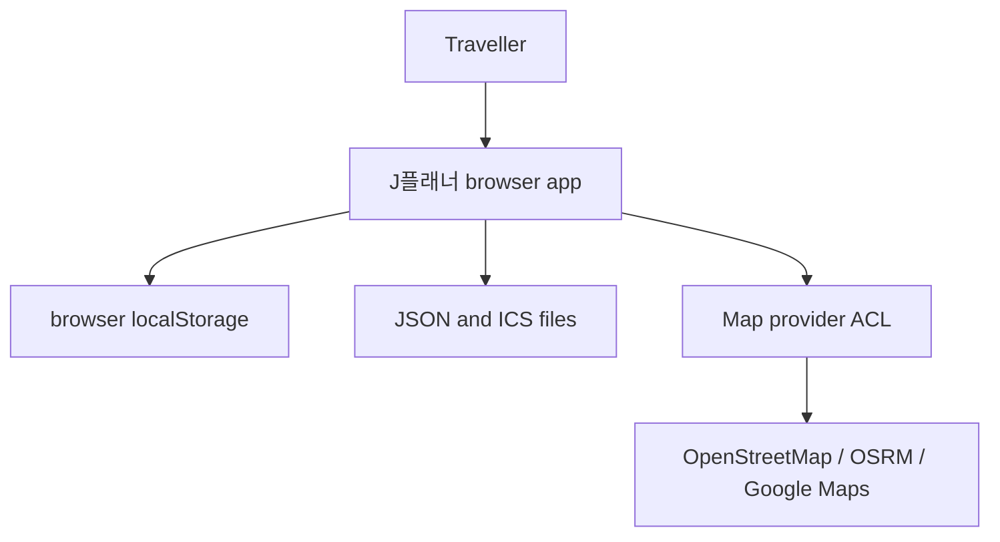
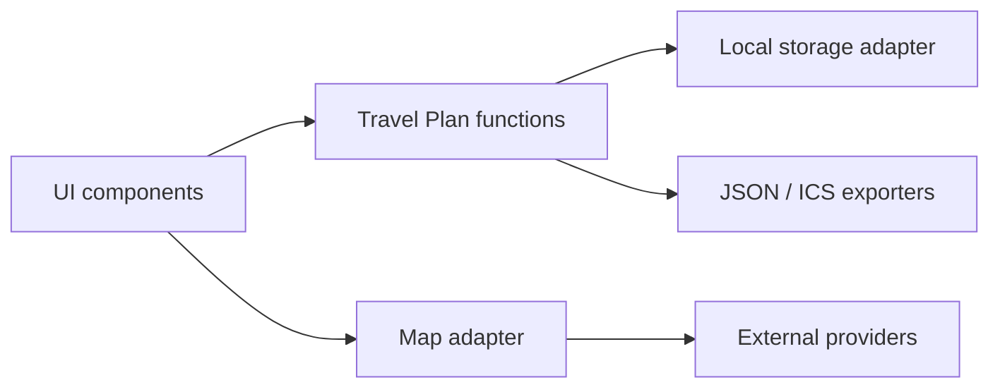
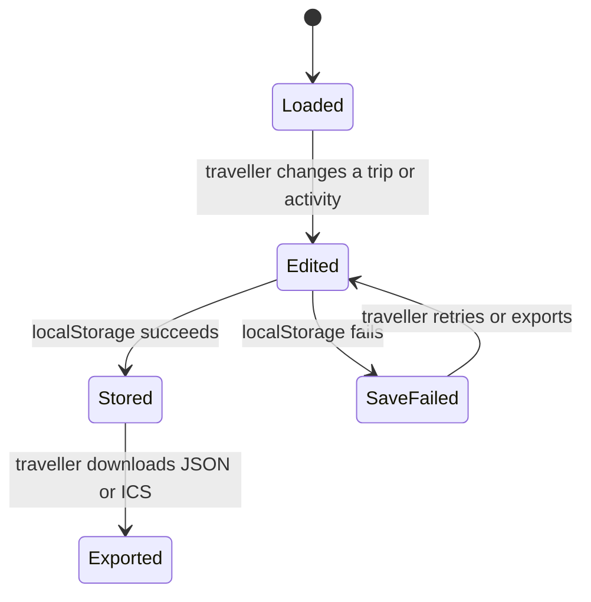

# J플래너 Architecture

Status: **Proposed**

## Domain model

The core Subdomain and Bounded Context is **Personal Travel Planning**. Its Ubiquitous Language is Traveller, Travel Plan, Trip, Activity, Flight, Attachment, Calendar Export, and Map Navigation.

The **Travel Plan aggregate** owns the trip collection and active-trip identity. A Trip contains dated activities, flight facts, city labels, notes, and presentation choices. An Activity contains time, category, place text, optional coordinates, notes, movement hints, alarm text, and browser-local attachments. Changes are committed together to the browser-local aggregate; no cross-service transaction exists.

## Context Map

J플래너 owns the application interaction and domain truth. The Map provider ACL translates product actions into external tile, route, or explicit navigation requests. External providers do not own or persist the Travel Plan aggregate.

## Component view

The components are logical seams inside the single `index.html`, not independently deployed services. This view must not be used to claim an API or a released shared Core.

## Persistence and ERD

**ERD status: not applicable.** The current product has no server database and no relational schema. Browser-local JSON mirrors the Travel Plan aggregate and is normalised at the application boundary. Introducing a database would require a separate decision covering aggregate transactions, 3NF storage, identifiers, migration, access control, locking, backup, retention, and an actual ERD.

## Main state transitions

## Failure boundaries

- A local storage failure leaves server durability unavailable and must be reported.
- A map tile or route failure must not invalidate local itinerary state.
- A stale route response must not replace the currently selected route.
- A blocked external window must produce a visible recovery instruction.
- Public geocoding remains absent until the governed provider-port prerequisites are released.

## Evolution rule

Reusable identity, gateway, translation, contract, or map-governance responsibilities belong to their canonical owners only after a versioned contract and immutable release exist. Until then, J플래너 uses its local port or a disabled feature; it does not copy owner source, read owner databases, or depend on temporary branches.
