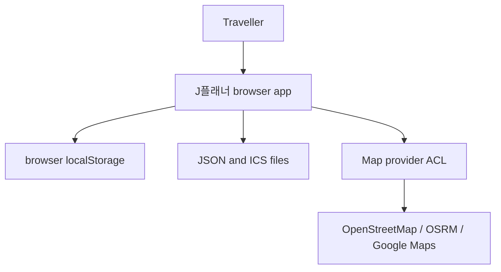
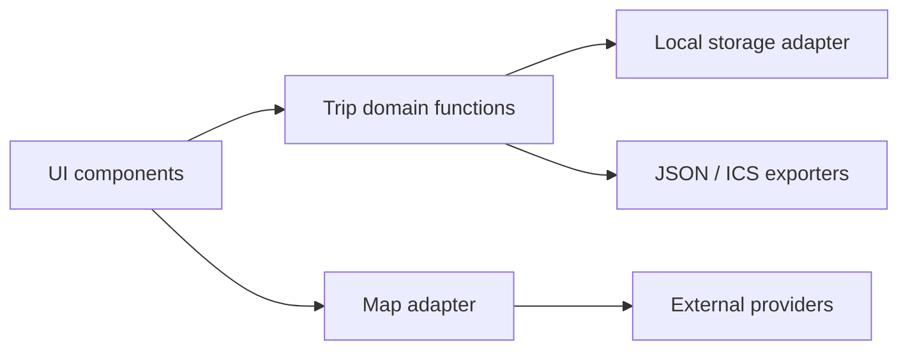
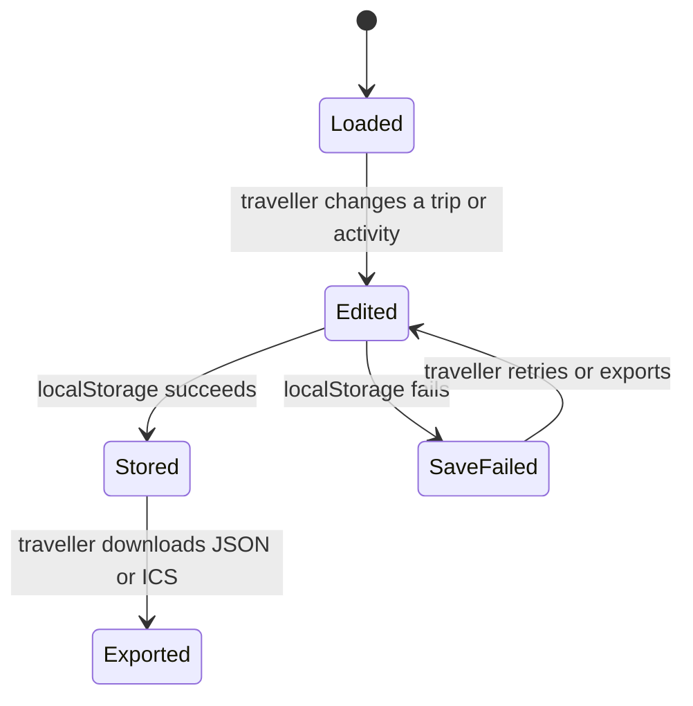

# J플래너 Architecture

Status: **Proposed**

## Domain model

The core Subdomain is **Personal Travel Planning**. This repository implements the **J플래너 Planning Bounded Context**. Its Ubiquitous Language is Traveller, Trip, Activity, Flight, Attachment, Calendar Export, and Map Navigation.

The **Trip aggregate** contains dated activities, flight facts, city labels, notes, and presentation choices. An Activity contains time, category, place text, optional coordinates, notes, movement hints, alarm text, and browser-local attachments. The browser serialises a collection of Trip records plus the active-trip identity as application state; that persistence envelope is not a separate domain aggregate.

No second product Bounded Context is implemented, so there is no inter-context relationship to claim as a mature DDD Context Map. External map systems are reached through an anti-corruption boundary and are shown in the system context below.

## System context

J플래너 owns the application interaction and domain truth. The Map provider ACL translates product actions into external tile, route, or explicit navigation requests. External providers do not own or persist Trip aggregates.

## Component view

The components are logical seams inside the single `index.html`, not independently deployed services. This view must not be used to claim an API or a released shared Core.

## Persistence and ERD

**ERD status: not applicable.** The current product has no server database and no relational schema. Browser-local JSON is an application-state envelope containing Trip records and is normalised at the application boundary. Introducing a database would require a separate decision covering aggregate transactions, 3NF storage, identifiers, migration, access control, locking, backup, retention, and an actual ERD.

## Main state transitions

## Failure boundaries

- A local storage write failure leaves server durability unavailable and produces a visible warning. Read/removal failures still require product-visible handling.
- A map tile or route failure must not invalidate local itinerary state.
- A route failure currently falls back to a straight line without a visible warning.
- A late route response cannot replace the currently selected or empty route view.
- A blocked external window must produce a visible recovery instruction.
- Public geocoding remains absent until the governed provider-port prerequisites are released.

## Decision boundary

This document describes logical seams within one static application, not released services. A new backend, database, shared contract, or external capability requires its own evidence-backed decision before it changes this boundary.
